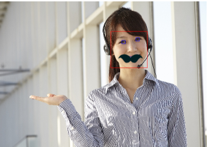
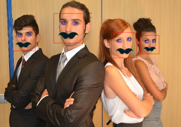
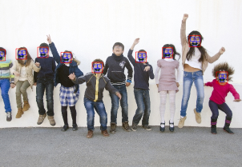

# FacialRecognition

This is iOS Facial Recognition Sample Project in Swift Language.

## Usage

git clone git@github.com:oggata/FacialRecognition.git

## ToDo's

- Use images from device's album.
- Use images from device's camera
- Suggestions, issues and pull requests are more than welcome.

## Document
Qiita
http://qiita.com/oggata/items/8fc84124a256bfa505c0

## Contact

Fumitoshi Ogata
- [twitter.com/oggata](http://twitter.com/oggata)
- oggata@gmail.com

## License
FacialRecognition is available under the MIT license. 
See the LICENSE file for more info.
